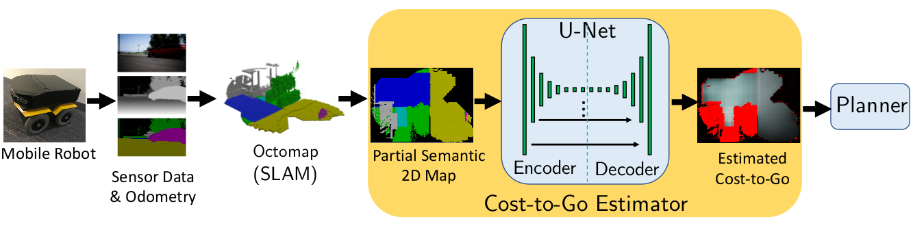

# DC2G: Deep Cost-to-Go Planning Algorithm (IROS '19)

*Planning Beyond the Sensing Horizon Using a Learned Context*

Michael Everett, Justin Miller, Jonathan P. How

IEEE/RSJ International Conference on Intelligent Robots and Systems (IROS), 2019

Paper: [https://arxiv.org/abs/1908.09171](https://arxiv.org/abs/1908.09171)

Video: [https://youtu.be/yVlnbqEFct0](https://youtu.be/yVlnbqEFct0)



**Note:** This repo contains the following code that was approved for release:
- Bing Maps Driveway Dataset (~80 houses)
- Pre-trained cost-to-go estimation network
- Gridworld evaluation environment (built on gym-minigrid)
- Jupyter Notebook to explain code (coming soon...)

### Install
```sh
git clone --recursive <this repo>
cd dc2g
./install.sh
```

### Run Example
```bash
./example.sh
```

### Evaluate in the Gridworld (maybe more detailed than needed)
```sh
python -m dc2g.run_episode -p dc2g
```

### Repo Structure/Organization

**Bing Maps Driveway Dataset:**
* `data/datasets/driveways_bing_iros19` contains `.png`s of the 80 houses split into train/val/test, in 3 formats:
  - `raw`: satellite image
  - `full_semantic`: same size as satellite image, but each pixel colored by semantic class
  - `full_c2g`: same size as satellite image, but each pixel colored by grayscale intensity corresponding to cost-to-go to door pixels. Non-traversable terrain (grass) is colored red.
* `data/scripts`: contains various python scripts to compute cost-to-go, apply masks, etc. to generate the training datasets

**Pre-trained cost-to-go estimation network:**
* `data/trained_networks/driveways_bing_iros19_full_test_works` holds the `checkpoint`, `export.index`, and `export.meta` files needed to load the network in Python. We also include `options.json` to see hyperparameters used to train to generate this network.

**DC2G Planner Code:**
* `dc2g/planners` contains several planners, all of which inherit from `Planner.py`.

**Environment Evaluation code:**
* `dc2g/run_episode.py` instantiates the environment and a planner and runs one episode
* `dc2g/run_experiment.py` instantiates the environment and runs many episodes with many planners to compute statistics

**Environment code:**
* `gym-minigrid` follows the OpenAI Gym API (`env.step`,`env.reset`, etc.) and the particular python script of interest here is `gym-minigrid/gym_minigrid/envs/slam.py`, which inherits from `gym-minigrid/gym_minigrid/minigrid.py` and gives extra capabilities to build up a map of the env over time.

**Jupyter notebook:**
Coming soon...

### TODOs

- [ ] Create Jupyter notebook to explain code
- [ ] Confirm `run_episode.py` works
- [ ] Confirm `run_experiment.py` works
- [ ] Confirm each planner works
- [ ] Confirm each planner works
- [ ] Pull our custom `slam.py` code out of `gym-minigrid`
- [ ] Add instructions for generating masked semantic/c2g images
- [ ] Add scripts to generate plots from paper

### If you find this code useful, please consider citing our paper:
```
@inproceedings{Everett19_IROS,
	Address = {Macau, China},
	Author = {Michael Everett and Justin Miller and Jonathan P. How},
	Booktitle = {IEEE/RSJ International Conference on Intelligent Robots and Systems (IROS)},
	Date-Modified = {2019-06-22 06:18:08 -0400},
	Month = {November},
	Title = {Planning Beyond The Sensing Horizon Using a Learned Context},
	Year = {2019}
}
```
